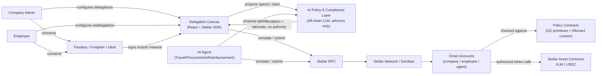
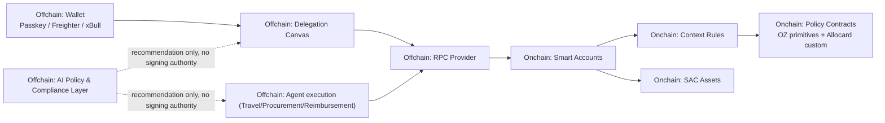
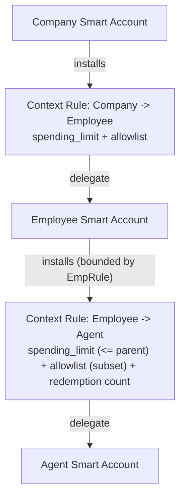
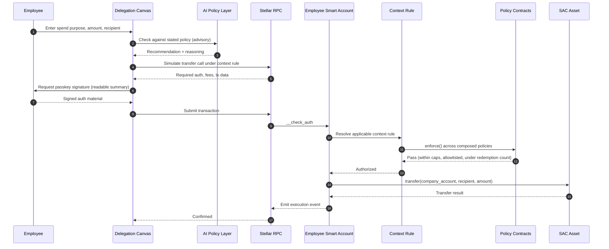
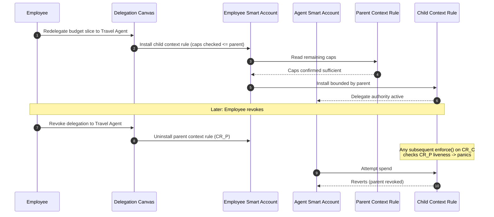

# Allocard Technical Architecture

| Field | Specification |
|---|---|
| Product | Allocard — non-custodial corporate expense card infrastructure |
| Network | Stellar / Soroban |
| Asset model | Stellar Asset Contract (SAC) — XLM and USDC |
| Primary wallets | Passkey (secp256r1/WebAuthn) smart accounts via an integrated toolkit, not a custom-built verifier |
| Authorization framework | OpenZeppelin `stellar-accounts` — `Policy` trait, context rules, audited caveat primitives |
| Architecture level | Full design for contracts, policy composition, AI decision layer, agent execution, and dApp |

## 1. Purpose

This document defines the technical architecture for Allocard, a Soroban-native system for scoped, revocable spending delegation. A company delegates spending authority to an employee or AI agent without ever transferring custody of funds; every transaction is checked against on-chain caveats before it can execute. Employees can further redelegate a bounded slice of their own authority to task-specific agents, and revoking any delegation cascades to everything delegated beneath it.

### 1.1 Document Policy

- **MUST**: required for a correct, secure Allocard deployment.
- **SHOULD**: strongly recommended; exceptions require explicit engineering sign-off.
- **MAY**: optional, does not affect core security.
- **V1**: the first complete architecture, scoped to the SCF Build Award tranches.

## 2. Executive Summary

Allocard is a policy-controlled spending account built as a Soroban smart account. Each delegation — company → employee, or employee → agent — is represented as a **context rule** on the delegate's smart account, paired with one or more **Policy contracts** that enforce caveats on every transaction attempted under that rule. Caveats compose: a single delegation can carry a spending cap, a recipient allowlist, and a redemption-count limit simultaneously.

| Area | Design Choice |
|---|---|
| Custody model | Funds are never pre-transferred to the delegate; the smart account holding the policy is the one holding funds, or the policy gates a transfer-on-behalf-of pattern (see §4.3) |
| Authorization model | Soroban `__check_auth` + OpenZeppelin `stellar-accounts` context rules and `Policy` contracts |
| Caveat enforcement | Reuse OZ's audited `spending_limit` and `simple_threshold`/`weighted_threshold` primitives wherever they fit; custom `Policy` contracts only for function/argument scoping, recipient allowlists, redemption-count limits, and redelegation-liveness checks |
| Redelegation | Nested context rules — a child delegation's policy set is checked against, and bounded by, its parent's remaining caps at install time |
| Revocation | Cascading, via parent-liveness checks inside each child `Policy::enforce()` — not a separate revocation registry |
| AI decision layer | Fully off-chain (LLM-based). It proposes and explains; it never signs. Every proposal still passes through on-chain policy enforcement regardless of what the AI decided |
| Asset support | SAC only in V1 — XLM and USDC |
| Signer model | Passkey (secp256r1/WebAuthn) via an integrated toolkit, Ed25519 as a fallback signer path |

## 3. Architecture Decisions

These decisions remove ambiguity for implementation and make the funded engineering scope legible against what is integrated, not rebuilt.

### Decision 1 — Build on OpenZeppelin's `stellar-accounts` framework instead of a custom smart-account stack

OpenZeppelin's Stellar smart-account framework already gives Soroban programmable authorization: context rules, delegated/external signers, and composable `Policy` contracts implementing:

```rust
pub trait Policy {
    type AccountParams: FromVal<Env, Val>;
    fn enforce(e: &Env, context: Context, authenticated_signers: Vec<Signer>,
               context_rule: ContextRule, smart_account: Address);
    fn install(e: &Env, install_params: Self::AccountParams,
               context_rule: ContextRule, smart_account: Address);
    fn uninstall(e: &Env, context_rule: ContextRule, smart_account: Address);
}
```

`enforce()` inspects the Soroban authorization context — `soroban_sdk::auth::Context::Contract(ContractContext { contract, fn_name, args })` — and panics to reject. Allocard's caveats are implemented as `Policy` contracts registered against a context rule, exactly as this framework intends. We do not write our own `__check_auth` from scratch, and we do not write our own threshold/multisig logic — both are already audited in OZ's framework.

### Decision 2 — Reuse-first caveat synthesis: audited primitives before custom Rust

| Caveat | Implementation |
|---|---|
| Per-transaction cap, lifetime cap, periodic (recurring) allowance | OZ **`spending_limit`** (`SpendingLimitAccountParams { spending_limit, period_ledgers }`). A lifetime cap is a `spending_limit` with a very large `period_ledgers`; a periodic allowance is the same primitive with a window sized to the reset period; a per-transaction cap is a thin custom check composed alongside it, since `spending_limit` enforces a rolling-window total, not a single-transaction ceiling |
| N-of-M / weighted approval (used for high-value company-level delegations) | OZ **`simple_threshold`** / **`weighted_threshold`** |
| Recipient allowlist, function/argument-level scoping (which contract, which function, which recipient) | **Custom minimal `Policy`** — no OZ primitive exists for this. Asserts `context.contract`, `context.fn_name`, and the relevant `args` (e.g. the `to` argument of a SAC `transfer`) against a stored allowlist; defers value caps to the composed `spending_limit` |
| Redemption-count limit (max number of uses of a delegation) | **Custom `Policy`**, storage-namespaced by `(smart_account, context_rule_id)` per the framework's storage-segregation requirement, incrementing a counter on each successful `enforce()` and panicking past the configured maximum |
| Redelegation liveness (child delegation dies if parent is revoked) | **Custom `Policy`** — see Decision 3 |

A greenfield rewrite is not proposed. OZ primitives are reused wherever the constraint fits them; custom Rust is scoped to exactly the caveats Allocard needs that the framework does not already provide.

### Decision 3 — Redelegation and cascading revocation via nested context rules, not a separate delegation registry

An employee redelegating a slice of their budget to an agent is modeled as: the agent's smart account gets a new context rule, with a `Policy` set that is checked at install time to be a strict subset of the employee's own remaining caps (same or tighter spending cap, same or narrower recipient allowlist, same or lower redemption count).

Cascading revocation does not use a separate "delegation manager" contract tracking parent/child relationships off the hot path. Instead, each child `Policy::enforce()` includes a liveness check against the parent context rule's installed state. If the parent context rule has been uninstalled (revoked), the child's `enforce()` panics regardless of whether the child's own caveats would otherwise permit the transaction. This keeps revocation a single on-chain action (uninstall the parent context rule) with no separate propagation step, and it is checked live on every spend rather than relying on an off-chain indexer to catch a revoked delegation.

### Decision 4 — Passkey signing is integrated, not built

Allocard does not implement a custom secp256r1/WebAuthn verifier, credential-registration flow, or key-management layer. It integrates an existing Soroban passkey toolkit (e.g. `passkey-kit`, `github.com/kalepail/passkey-kit`, paired with `launchtube` for fee-sponsored submission) or OpenZeppelin's own Soroban smart-account WebAuthn contracts where that integration is more direct. The specific toolkit is selected during integration based on audit history and license fit; it is not pinned here. Wallet connection and signing for the testnet validation path also supports Freighter/xBull via Stellar Wallets Kit as an Ed25519 fallback signer path, so the system is not blocked on passkey integration risk alone.

### Decision 5 — The AI decision layer is advisory-only and fully off-chain

The LLM-based policy and compliance layer (text + vision, for reading receipts and natural-language company policy) never holds signing authority and is never itself a `Policy` contract. It proposes a transaction and a rationale; the transaction is then submitted through the normal smart-account signing path (the employee's or agent's own signer) and is still checked by the on-chain `Policy` contracts regardless of what the AI decided. This means an AI misjudgment can at worst propose a transaction that then gets correctly rejected on-chain — it can never itself authorize a transaction outside the delegation's caveats. This mirrors the trust-boundary principle used in both reference architectures we reviewed: off-chain components may prepare, recommend, and display, but only on-chain policy authorizes value movement.

### Decision 6 — Budget scope: what Allocard builds versus what Allocard integrates

Integrated, not built:
- Smart-account authorization core (`__check_auth`, context rules, signer management) — integrated from OZ `stellar-accounts`.
- Threshold/multisig primitives — integrated from OZ `simple_threshold` / `weighted_threshold`.
- Spending-cap enforcement primitive — integrated from OZ `spending_limit`.
- Passkey/WebAuthn signer verification — integrated per Decision 4, not built as a custom verifier.
- Wallet connection and signing UX — integrated through Stellar Wallets Kit (Freighter, xBull) and the chosen passkey toolkit.
- The asset interface itself — integrated through the standard Stellar Asset Contract, not a custom token model.
- Transaction simulation, fee calculation, and submission — integrated through Stellar RPC and `@stellar/stellar-sdk`.

Net-new, funded engineering:
- The recipient-allowlist and function/argument-scoping `Policy` contract (no OZ primitive covers this).
- The redemption-count `Policy` contract.
- The redelegation-bounding logic (child caps validated as a subset of parent caps at install time).
- The parent-liveness cascading-revocation check inside child `Policy::enforce()`.
- The off-chain AI policy/compliance layer and its integration with the on-chain proposal → sign → enforce flow.
- The agent execution framework (Travel, Procurement, Reimbursement agents) that consumes redelegated context rules.
- The Delegation Canvas reference application.

In short: the authorization math (thresholds, spending caps, signer verification) is integrated from audited OZ infrastructure. The funded work is the delegation-specific caveats OZ does not provide, the redelegation/revocation pattern built on top of context rules, and everything that makes the primitive usable as an actual expense-card product.

## 4. System Context

### 4.1 System Context Diagram



Key takeaway: the AI layer sits entirely off-chain, between the person/agent and the wallet, and never has a path to Soroban that bypasses the smart account's own signing and policy checks.

### 4.2 Trust Boundary



Boundary rule: **the AI layer, the agents' own request logic, the frontend, and the RPC provider can propose, display, and submit — none of them can decide whether a transfer is authorized.** Only the on-chain `Policy` contracts, enforced through `__check_auth`, decide that.

## 5. Onchain Architecture

### 5.1 Smart Accounts

Every company, employee, and agent holds a Soroban smart account built on OZ `stellar-accounts`. A company's smart account holds the company's funds (as SAC balances) and installs context rules naming each employee as a delegate. An employee's smart account does not itself hold the delegated funds in V1 — it holds the *authority* to spend from the company account, exercised via a context-rule-scoped call. This avoids a pre-funding step entirely: nothing moves until a transaction is attempted, checked, and settles atomically.

### 5.2 Context Rules and Policy Composition

A context rule binds a delegate (employee or agent smart account) to a set of `Policy` contracts on the delegator's (company or employee) smart account. A single context rule can compose:

| Policy | Source | Enforces |
|---|---|---|
| `spending_limit` (lifetime variant) | OZ, reused | Total spend across the delegation's lifetime |
| `spending_limit` (periodic variant) | OZ, reused | Rolling-window allowance (daily/weekly/monthly) |
| Per-transaction cap | Allocard, custom, composed alongside `spending_limit` | Maximum single-transaction amount |
| Recipient allowlist | Allocard, custom | Which SAC `transfer` destinations are permitted |
| Function/argument scoping | Allocard, custom | Which contract and function the delegate may call at all |
| Redemption count | Allocard, custom | Maximum number of successful spends under this delegation |
| Redelegation liveness | Allocard, custom | Parent context rule must still be installed, or `enforce()` panics |

All custom policies namespace their storage by `(smart_account, context_rule_id)`, matching the storage-segregation requirement of the underlying framework, so that two different delegations on the same account never read or write each other's state.

### 5.3 Redelegation



At install time, the redelegation flow reads the parent context rule's configured caps and rejects installation if any child caveat would exceed them (higher spending cap, broader recipient set, or higher redemption count than the parent allows). This check happens once, at install; the **liveness** check (parent still active) happens on every subsequent `enforce()` call, which is what gives revocation its cascading property without a separate propagation step.

### 5.4 Asset Handling

V1 is SAC-only — XLM and USDC. Every supported asset is explicitly configured on the delegator's smart account; unsupported assets fail closed. All settlement for company spend uses SAC `transfer`, not classic Stellar path payments or SDEX operations, consistent with how both reference architectures scope their V1 asset handling.

## 6. Signer and Onboarding Architecture

### 6.1 Signer Paths

| Path | Status | Use |
|---|---|---|
| Passkey (secp256r1/WebAuthn) | Production path, integrated toolkit | Seedless onboarding for employees and companies; the default UX |
| Ed25519 via Freighter/xBull (Stellar Wallets Kit) | Fallback / validation path | Used during testnet validation and for any signer context where the integrated passkey toolkit's auth-entry support needs end-to-end confirmation first |
| Agent smart account signer | Scoped, programmatic | Agent smart accounts hold their own signer (not a passkey, since there's no human present); signing is performed by the agent execution service against its own key, itself bounded entirely by the context rule it was redelegated |

### 6.2 Onboarding Flow

1. Employee is invited by a company admin.
2. Employee creates a passkey credential through the integrated toolkit's existing WebAuthn registration flow.
3. A smart account is deployed for the employee (deterministic factory), with a signer record bound to the passkey's public key and credential metadata.
4. The company admin installs a context rule on the company account naming the employee's smart account as delegate, with the agreed caveats.
5. First transaction is fee-sponsored (via the passkey toolkit's paired relayer, e.g. `launchtube`) so the employee never needs to hold XLM to get started.

## 7. AI Policy & Compliance Layer

This layer is off-chain and advisory-only (Decision 5). It has two jobs:

1. **Direct-spend policy check.** Given a stated purpose and the delegation's caveats (read from on-chain context-rule configuration) plus any natural-language company policy, returns a pass/reject recommendation with reasoning before a transaction is even built. This exists to give good UX (reject early, explain why) — it is not the security boundary.
2. **Reimbursement claims.** Given a receipt (vision input) and a claim description, OCRs the receipt and checks it against the claim, returning a recommendation to a human approver or, for bounded auto-approval cases, triggering a transaction proposal that still passes through the same on-chain `Policy` checks as any other spend.

No output of this layer is ever treated as authorization. A transaction it recommends still has to be built, simulated, signed by the relevant smart account's own signer, and checked by the installed `Policy` contracts — exactly like any other transaction on the account.

## 8. Agent Execution Framework

Each agent (Travel, Procurement, Reimbursement) is its own Soroban smart account, redelegated a bounded context rule by the employee or company it acts for. The agent execution service:

1. Receives a request (e.g. "book a flight under $400 to the client site").
2. Uses the AI layer to research/propose a specific transaction within the agent's known caveats (reading the context rule's configured caps and allowlist so it never proposes something it already knows will fail).
3. Builds and simulates the transaction via Stellar RPC.
4. Signs with the agent's own smart-account signer.
5. Submits; the on-chain `Policy` set makes the actual authorization decision, independent of what the agent "intended."

This separation — agent proposes, chain decides — is what makes it safe to let an agent hold signing authority at all: a bug or a bad proposal in the agent's logic can only ever produce a transaction that the chain then correctly rejects if it's out of scope.

## 9. Key Workflows

### 9.1 Immediate Delegated Spend



### 9.2 Redelegation and Cascading Revocation



### 9.3 Reimbursement Claim

1. Employee submits a reimbursement claim with a receipt photo and description.
2. AI layer OCRs the receipt, checks it against the claim and the reimbursement-delegation's caveats.
3. If within bounds, a transaction proposal is built: company → employee, under the reimbursement context rule.
4. Transaction is simulated, signed (by a designated approver signer or, for bounded auto-approval amounts, by a scoped automation signer), and submitted.
5. On-chain `Policy` checks (cap, allowlist = employee's own address, redemption count for the period) make the final authorization decision.

## 10. Security Architecture

### 10.1 Trust Boundaries

Trusted on-chain root: the smart account's `__check_auth`, via OZ `stellar-accounts`.
Constrained on-chain modules: context rules, composed `Policy` contracts (both OZ and Allocard-custom).
Untrusted or semi-trusted off-chain components: the Delegation Canvas frontend, the AI policy layer, the agent execution services, the RPC provider.

Critical rule, consistent with both reference architectures reviewed: **off-chain components may prepare, recommend, sign-request, and display actions, but only on-chain policy can authorize value movement.**

### 10.2 Security Invariants

- A smart account's funds can only move through a transaction that passes `__check_auth` and every composed `Policy::enforce()` for the relevant context rule.
- A child context rule cannot be installed with caveats exceeding its parent's remaining caps.
- A child context rule's `enforce()` MUST fail if its parent context rule has been uninstalled.
- The AI policy layer's recommendation is never itself sufficient to authorize a transaction.
- An agent smart account cannot exceed the caveats of the context rule it was redelegated, regardless of what the agent execution service "decided" to propose.
- Redemption-count and spending-cap state is namespaced per `(smart_account, context_rule_id)` and cannot be read or mutated by a different delegation's policy.
- Unsupported assets and unlisted recipients fail closed.

### 10.3 Security Review Matrix

| Review Area | Primary Risk | Required Verification |
|---|---|---|
| Context-rule authorization | Invalid signer or stale context rule accepted by `__check_auth` | Verify network, smart account address, function, context rule ID, and signer binding |
| Caveat composition | Composed policies (spending cap + allowlist + redemption count) interact incorrectly, allowing a bypass | Test each policy in isolation and in composition; test ordering independence |
| Redelegation bounding | Child caveats installed exceeding parent's remaining caps | Test install-time rejection for every caveat dimension (cap, allowlist, redemption count) |
| Cascading revocation | Child delegation continues to function after parent revocation | Test that a revoked parent causes every descendant's next `enforce()` to panic, including multi-level chains |
| AI layer boundary | AI recommendation mistaken for or wired as authorization | Test that a transaction proposed by the AI layer but violating on-chain caveats is rejected on-chain regardless of AI output |
| Agent signer scope | Agent smart account signer used outside its redelegated context rule | Test that agent-signed transactions outside the agent's context rule are rejected |
| Passkey integration | Passkey toolkit integration mishandles credential binding or replay | Follow the integrated toolkit's own test suite; add Allocard-specific binding tests for signer record ↔ context rule |
| Storage segregation | Policy state for one context rule leaks into or overwrites another | Test storage keys are correctly namespaced by `(smart_account, context_rule_id)` across all custom policies |

## 11. Stellar Tech Stack

- **Network:** Stellar / Soroban, most recent stable protocol at time of deployment (reconfirm at implementation start).
- **Smart-account framework:** OpenZeppelin `stellar-accounts` (`Policy` trait, context rules, `spending_limit`, `simple_threshold`/`weighted_threshold`).
- **Custom contracts:** Rust, `soroban-sdk`, targeting `wasm32v1-none`, built with `stellar-cli`.
- **Passkey/signing:** integrated toolkit (e.g. `passkey-kit` + `launchtube`), Stellar Wallets Kit for Freighter/xBull fallback.
- **Asset model:** Stellar Asset Contract (SAC) — XLM, USDC.
- **Frontend:** React + `@stellar/stellar-sdk`, React Flow for the Delegation Canvas.
- **AI layer:** off-chain LLM API (text + vision), advisory-only, no signing authority.
- **RPC/simulation:** Stellar RPC `simulateTransaction` / `sendTransaction` / `getTransaction`, two-phase simulate-then-sign-then-submit flow.

## 12. Deployment Path

1. **Testnet MVP:** smart accounts + composed `Policy` suite deployed and verifiable on Stellar Testnet; delegate → spend → revert-on-violation demonstrated on-chain.
2. **Testnet redelegation and passkey onboarding:** nested context rules, cascading revocation, passkey-based onboarding, fee-sponsored first transaction.
3. **Testnet agents and reference app:** AI policy layer, agent execution framework, Delegation Canvas, all operating against the testnet contract suite.
4. **Mainnet:** reviewed contract suite deployed to Stellar Mainnet, settling in USDC, with a small-value public demonstration transaction.
